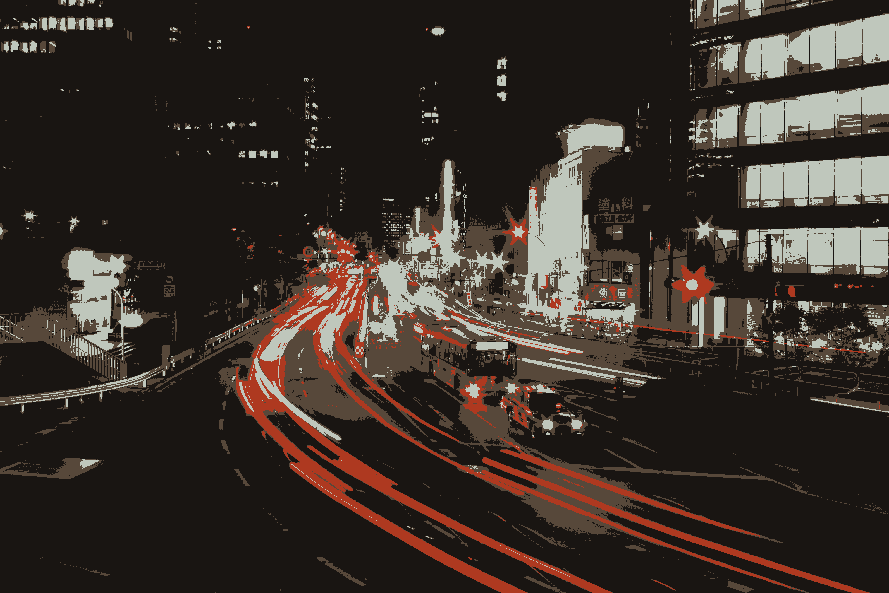

# k-means-gpu

Calculate the k average colors in an image using k-means clustering, leveraging your gpu to do the heavy lifting.

Totally 100% inspired by [kmeans-colors](https://github.com/okaneco/kmeans-colors).

## Limitation

Not there yet.

* Only supports RGB color space although Lab looks more promising.
* Currently initialize centroids with random values, should look how complex it is to paralellize kmean++ init.

As this loads an image as a texture to your graphic cards, it also comes with some limitation based on the GPU backends. Like, it probably won't work if the original image is bigger than 4086x4086 pixels.

## Sample


```rust
cargo run --release -- -i .\gfx\tokyo.jpg -k 4
```


