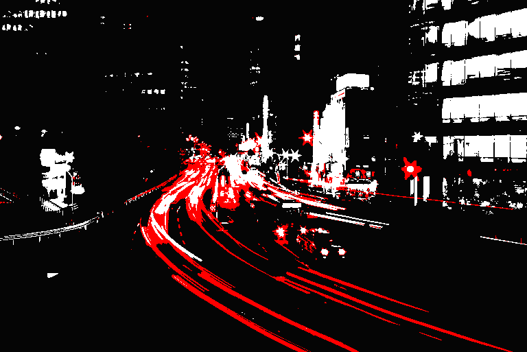

# k-means-gpu

Calculate the k average colors in an image using k-means clustering, leveraging your gpu to do the heavy lifting.

Totally 100% inspired by [kmeans-colors](https://github.com/okaneco/kmeans-colors).

## Limitation

As this loads an image as a texture to your graphic cards, it also comes with some limitation based on the GPU backends: It won't work if the original image is bigger than **8192x8192** pixels.

## Sample


### Create image with colors replaced by their kmeans variant:

```sh
cargo run --release -- reduce -i .\gfx\tokyo.png -c 8
```


### Create a dithered image with colors reduced with kmeans:

```sh
cargo run --release -- reduce -i .\gfx\tokyo.png -c 8 -m dither
```


### Find colors and use them as replacement

```sh
cargo run --release -- find -i .\gfx\tokyo.png -p "#050505,#ffffff,#ff0000"
```



### Find colors and use them to dither the image

```sh
cargo run --release -- find -i .\gfx\tokyo.png -p "#050505,#ffffff,#ff0000" -m dither
```


### Output the palette:

```sh
cargo run --release -- palette -i .\gfx\tokyo.png -c 8
```


## Sources

I had to read a bunch of stuff to even start to make sense of it all.
* First of all, the excellent [kmeans-colors](https://github.com/okaneco/kmeans-colors) inspired this project.
* A few articles from [Muthukrishnan](https://muthu.co/):
  + https://muthu.co/reduce-the-number-of-colors-of-an-image-using-uniform-quantization/
  + https://muthu.co/reduce-the-number-of-colors-of-an-image-using-k-means-clustering/
  + https://muthu.co/mathematics-behind-k-mean-clustering-algorithm/
* About prefix sum:
  + https://en.wikipedia.org/wiki/Prefix_sum
  + Prefix sum in wgsl: https://github.com/googlefonts/compute-shader-101/blob/prefix/compute-shader-hello/src/shader.wgsl
  + https://github.com/linebender/piet-gpu/blob/prefix/piet-gpu-hal/examples/shader/prefix.comp
* About dithering:
  + https://en.wikipedia.org/wiki/Ordered_dithering
  + http://alex-charlton.com/posts/Dithering_on_the_GPU/
* Resources:
  + Resurrect 64 color palette by [Kerrie Lake](https://lospec.com/kerrielake).

## License

MIT
